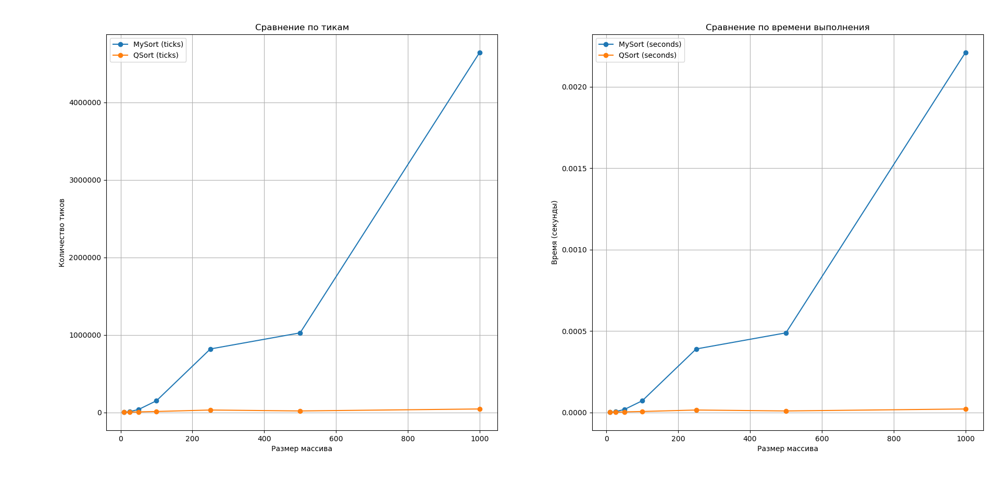
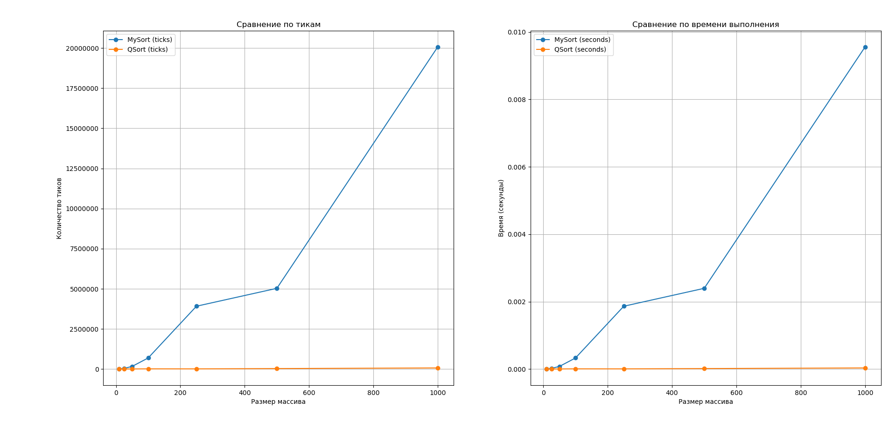
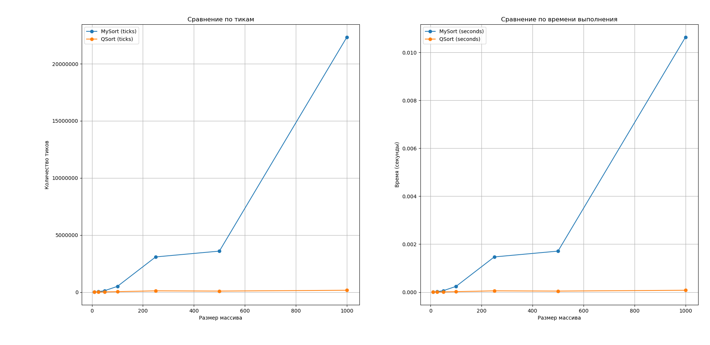

Для исследования я провел тесты функций сортировок mysort и qsort на размерах массивов 10, 25, 50, 100, 250, 500, 1000

Для более четкого представления картины были использованы три вариации записи данных в массив 
1. Массив отсортирован
2. Массив отсортирован в обратном порядке
3. Массив заполнен случайными числами

примеры выполнения работы программы (значения)
Результаты сортировок для отсортированного массива
|  Size  |   MySort ticks  |   MySort seconds  |   QSort ticks  |   QSort seconds  |
|--------|-----------------|-------------------|----------------|------------------|
|    10  |            2662 |      0.0000012676 |          2386  |    0.0000011362  |
|    25  |           10433 |      0.0000049681 |          4458  |    0.0000021229  |
|    50  |           37796 |      0.0000179981 |          7245  |    0.0000034500  |
|   100  |          150980 |      0.0000718952 |         12297  |    0.0000058557  |
|   250  |          818463 |      0.0003897443 |         30988  |    0.0000147562  |
|   500  |         1026231 |      0.0004886814 |         19150  |    0.0000091190  |
|  1000  |         4642697 |      0.0022108081 |         44598  |    0.0000212371  |

Результаты сортировок для отсортированного массива в обратном порядке
|  Size  |   MySort ticks  |   MySort seconds  |   QSort ticks  |   QSort seconds  |
---------|-----------------|-------------------|----------------|------------------|
|    10  |            7968 |      0.0000037943 |          2617  |    0.0000012462  |
|    25  |           44648 |      0.0000212610 |          5174  |    0.0000024638  |
|    50  |          167552 |      0.0000797867 |          9146  |    0.0000043552  |
|   100  |          694609 |      0.0003307662 |         17636  |    0.0000083981  |
|   250  |         3917275 |      0.0018653690 |         15827  |    0.0000075367  |
|   500  |         5032485 |      0.0023964214 |         34613  |    0.0000164824  |
|  1000  |        20069654 |      0.0095569781 |         73112  |    0.0000348152  |

Результаты сортировок для массива, заполненного случайными числами
|  Size  |   MySort ticks  |   MySort seconds  |   QSort ticks  |   QSort seconds  |
---------|-----------------|-------------------|----------------|------------------|
|    10  |           11516 |      0.0000054838 |          7033  |    0.0000033490  |
|    25  |           38917 |      0.0000185319 |          8810  |    0.0000041952  |
|    50  |          126201 |      0.0000600957 |         20923  |    0.0000099633  |
|   100  |          504325 |      0.0002401548 |         41811  |    0.0000199100  |
|   250  |         3082756 |      0.0014679790 |        112971  |    0.0000537957  |
|   500  |         3592975 |      0.0017109405 |         91016  |    0.0000433410  |
|  1000  |        22335988 |      0.0106361848 |        163431  |    0.0000778243  |
------------------------------------------------------------------------------------

График для сортировки отсортированного массива

График для сортировки массива который заполнен в обратном порядке

График для сортировки массива который заполнен случайными числами

